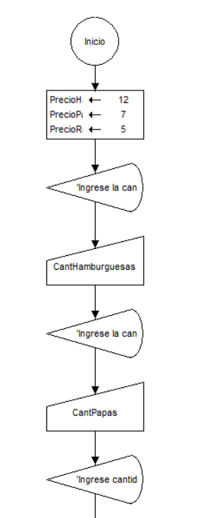

# 🍔 Sistema de Cálculo de Pedidos de Comida Rápida

## 📋 Descripción

Este proyecto contiene un algoritmo desarrollado en **DFD 1.1** para calcular el valor total de un pedido en una aplicación de comida rápida.

El algoritmo solicita al usuario la cantidad de productos deseados y calcula automáticamente el importe total de la compra según los precios establecidos.

---

## 🎯 Objetivo

Desarrollar un algoritmo utilizando diagramas de flujo que:

* Solicite la cantidad de hamburguesas.
* Solicite la cantidad de papas fritas.
* Solicite la cantidad de refrescos.
* Calcule los subtotales de cada producto.
* Obtenga el valor total del pedido.
* Muestre el resultado al usuario.

---

## 🍟 Menú de Productos

| Producto        | Precio Unitario |
| --------------- | --------------- |
| 🍔 Hamburguesa  | $12.00          |
| 🍟 Papas Fritas | $7.00           |
| 🥤 Refresco     | $5.00           |

---

## 🧮 Variables Utilizadas

### Variables de Entrada

* `CantHamburguesas`
* `CantPapas`
* `CantRefrescos`

### Variables de Proceso

* `valor_hamburguesa`
* `valor_papas_fritas`
* `valor_refresco`
* `TotalPedido`

### Constantes

* `PrecioHamburguesa = 12`
* `PrecioPapas = 7`
* `PrecioRefresco = 5`

---

## ⚙️ Fórmulas Utilizadas

```text
valor_hamburguesa = CantHamburguesas × 12
valor_papas_fritas = CantPapas × 7
valor_refresco = CantRefrescos × 5

TotalPedido = SubHamburguesas + SubPapas + SubRefrescos
```

## 📊 Diagrama de Flujo

El diagrama se encuentra disponible en:

```text
docs/diagrama.png
```

### Vista previa



---

## 📁 Estructura del Proyecto

```text
algoritmo-comida-rapida/
│
├── README.md
│
├── docs/
│   ├── diagrama.png
│   └── captura-ejecucion.png
│
└── source/
    └── pedido_comida_rapida.dfd
```

---

## 🧪 Caso de Prueba

### Entrada

```text
Hamburguesas: 2
Papas fritas: 1
Refrescos: 3
```

### Cálculo

```text
2 × 12 = 24
1 × 7  = 7
3 × 5  = 15

Total = 46
```

### Salida

```text
El valor total del pedido es: 46
```

---

## 🛠️ Herramientas Utilizadas

* DFD 1.1
* Git
* GitHub

---

## 🎓 Propósito Académico

Este proyecto fue desarrollado con fines educativos para practicar:

* Algoritmos.
* Diagramas de flujo.
* Variables.
* Operaciones aritméticas.
* Estructuras secuenciales.
* Control de versiones con Git y GitHub.

---

## 👨‍💻 Autor

Desarrollado como práctica de algoritmos utilizando DFD 1.1.
