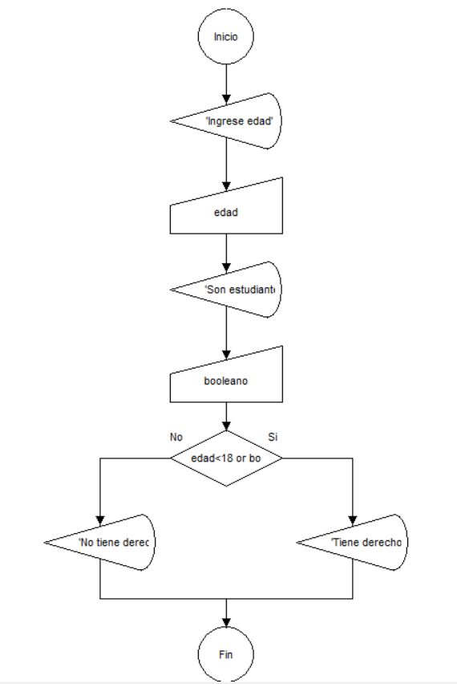

# 🎬 Sistema de Media Entrada para Cine

## 📋 Descripción

Este proyecto contiene un algoritmo desarrollado en **DFD 1.1** para determinar si un cliente tiene derecho a una media entrada en el cine.

El sistema evalúa dos condiciones:

* 👶 Tener menos de 18 años.
* 🎓 Ser estudiante.

Si al menos una de ellas se cumple, el cliente obtiene el beneficio de media entrada.

---

## 🎯 Objetivo

Desarrollar un algoritmo utilizando diagramas de flujo que:

* Solicite la edad del cliente.
* Solicite si el cliente es estudiante.
* Evalúe las condiciones establecidas.
* Determine si corresponde el descuento.
* Muestre el resultado al usuario.

---

## 📥 Variables Utilizadas

### Variables de Entrada

* `edad`
* `booleano`

### Significado de las Variables

| Variable | Tipo     | Descripción                                    |
| -------- | -------- | ---------------------------------------------- |
| edad     | Entero   | Edad del cliente                               |
| booleano | Booleano | Indica si el cliente es estudiante (.V. o .F.) |

---

## 🧠 Condición Utilizada

```text
edad < 18 O booleano = .V.
```

Si la condición es verdadera:

```text
Tiene derecho a media entrada
```

En caso contrario:

```text
No tiene derecho a media entrada
```

---

## 📊 Diagrama de Flujo

El diagrama se encuentra disponible en:

```text
docs/diagrama.png
```

### Vista previa



---

## 📁 Estructura del Proyecto

```text
02-media-entrada-cine/
│
├── README.md
│
├── docs/
│   ├── diagrama.png
│   └── captura-ejecucion.png
│
├── ejemplos/
│   └── casos_prueba.txt
│
└── source/
    └── media_entrada_cine.dfd
```

---

## 🧪 Caso de Prueba

### Entrada

```text
edad = 16
booleano = .F.
```

### Resultado

```text
Tiene derecho a media entrada
```

---

### Entrada

```text
edad = 25
booleano = .V.
```

### Resultado

```text
Tiene derecho a media entrada
```

---

### Entrada

```text
edad = 30
booleano = .F.
```

### Resultado

```text
No tiene derecho a media entrada
```

---

## 📄 Casos de Prueba Adicionales

Los escenarios completos de validación se encuentran en:

```text
ejemplos/casos_prueba.txt
```

---

## 🛠️ Herramientas Utilizadas

* DFD 1.1
* Git
* GitHub
* Visual Studio Code

---

## 🎓 Propósito Académico

Este proyecto fue desarrollado con fines educativos para practicar:

* Algoritmos
* Diagramas de flujo
* Variables
* Variables booleanas
* Operadores lógicos
* Estructuras condicionales
* Control de versiones con Git y GitHub

---

## 👨‍💻 Autor

Desarrollado como práctica de algoritmos utilizando DFD 1.1.
