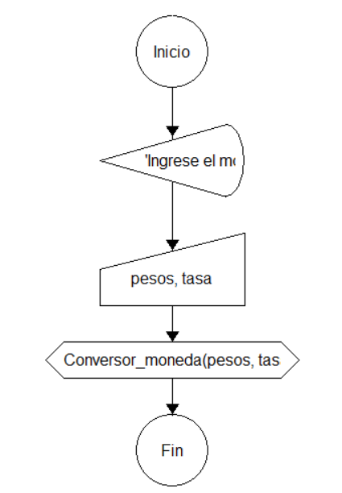
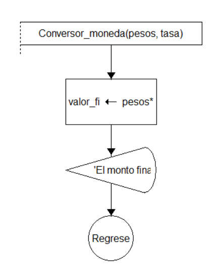
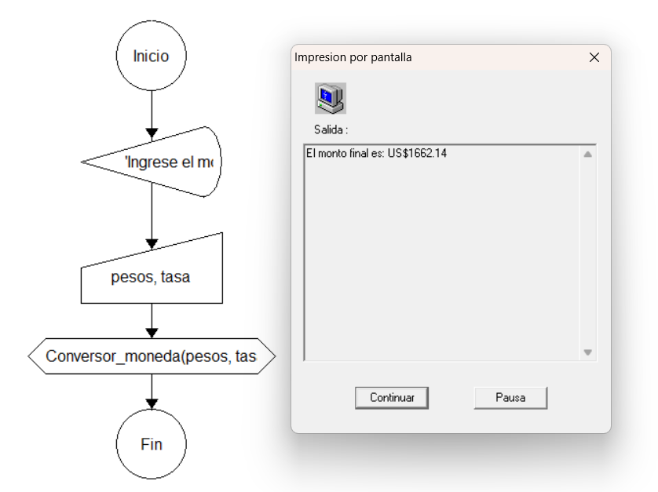

# 💱 Desafío 04 - Conversor de Monedas


## 📖 Descripción

Este proyecto desarrolla un algoritmo en **DFD 1.1** para una agencia de viajes que requiere convertir montos expresados en pesos ($) a dólares (US$).

La solución implementa una función denominada **Conversor_moneda(pesos, tasa)**, encargada de realizar la conversión utilizando una tasa de cambio definida por la empresa.

---

## 🎯 Objetivo

Desarrollar un algoritmo modular que:

✅ Solicite un valor en pesos.

✅ Utilice una tasa de cambio.

✅ Llame a una función para realizar la conversión.

✅ Muestre el resultado en dólares.

---

## 🧠 Lógica del algoritmo

### Flujo principal

1. Leer el valor en pesos.
2. Leer o definir la tasa de cambio.
3. Invocar la función `Conversor_moneda(pesos, tasa)`.
4. Mostrar el resultado convertido.
5. Finalizar el programa.

### Función Conversor_moneda

1. Recibir los parámetros `pesos` y `tasa`.
2. Calcular la conversión:

```text
dolares = pesos * tasa
```

3. Retornar el resultado.

---

## 📂 Estructura del proyecto

```text
Desafío_04.Conversor de monedas/
│
├── README.md
│
├── source/
│
├── docs/
│   ├── diagrama_principal.png
│   ├── diagrama_funcion.png
│   └── captura_ejecucion.png
│
└── ejemplos/
    └── casos_prueba.txt
```

---

## 🔧 Variables utilizadas

### Programa principal

| Variable | Tipo | Descripción                    |
| -------- | ---- | ------------------------------ |
| pesos    | Real | Valor ingresado por el usuario |
| tasa     | Real | Tasa de cambio utilizada       |
| dolares  | Real | Resultado de la conversión     |

### Función Conversor_moneda

| Parámetro | Tipo | Descripción             |
| --------- | ---- | ----------------------- |
| pesos     | Real | Monto a convertir       |
| tasa      | Real | Tasa de cambio aplicada |

---

## 📊 Diagramas

### 🏠 Diagrama principal

Resultado:



---

### ⚙️ Diagrama de la función Conversor_moneda

Resultado:



---

## ▶️ Ejecución del algoritmo

Resultado:



---

## 🧪 Casos de prueba

Los casos de prueba utilizados para validar el algoritmo se encuentran en:

```text
ejemplos/casos_prueba.txt
```

### Ejemplos

| Pesos ($) | Tasa    | Dólares (US$) |
| --------- | ------- | ------------- |
| 1000      | 0.00027 | 0.27          |
| 5000      | 0.00027 | 1.35          |
| 10000     | 0.00027 | 2.70          |

---

## 📝 Pseudocódigo

```text
Inicio

    Leer pesos
    Leer tasa

    dolares <- Conversor_moneda(pesos, tasa)

    Escribir dolares

Fin


Función Conversor_moneda(pesos, tasa)

    dolares <- pesos * tasa

    Retornar dolares

FinFunción
```

---

## 🚀 Conceptos aplicados

* Diagramas de Flujo de Datos (DFD 1.1)
* Funciones
* Parámetros
* Retorno de valores
* Modularización
* Algoritmos secuenciales
* Conversión de monedas

---

## 📁 Archivos incluidos

| Archivo                | Descripción                      |
| ---------------------- | -------------------------------- |
| README.md              | Documentación del proyecto       |
| diagrama_principal.png | Flujo principal del algoritmo    |
| diagrama_funcion.png   | Diagrama de la función           |
| captura_ejecucion.png  | Evidencia de ejecución           |
| casos_prueba.txt       | Casos utilizados para validación |

---

## 👨‍💻 Autor

Proyecto desarrollado como parte de prácticas de algoritmos utilizando **DFD 1.1**, aplicando funciones para promover la reutilización y organización de la lógica del programa.

---

⭐ Si este proyecto te resulta útil, considera darle una estrella al repositorio.
