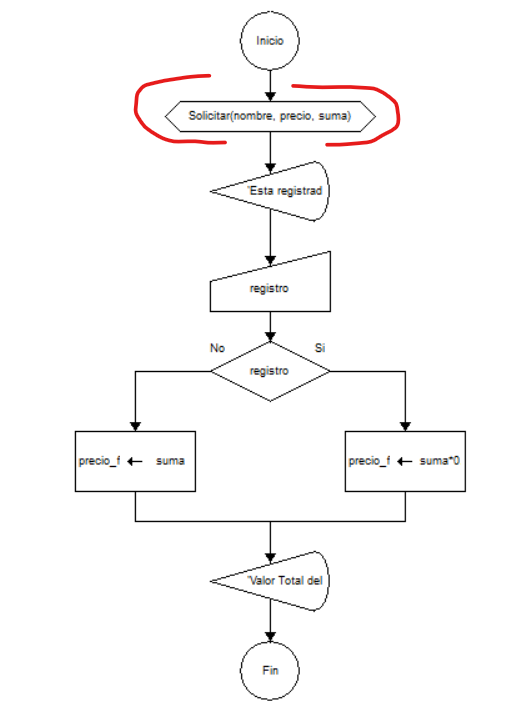
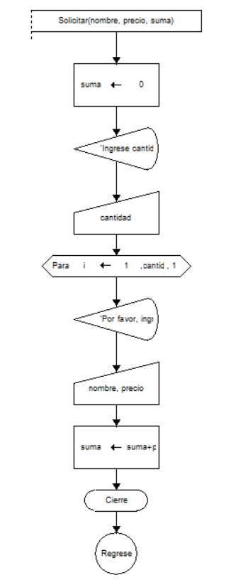
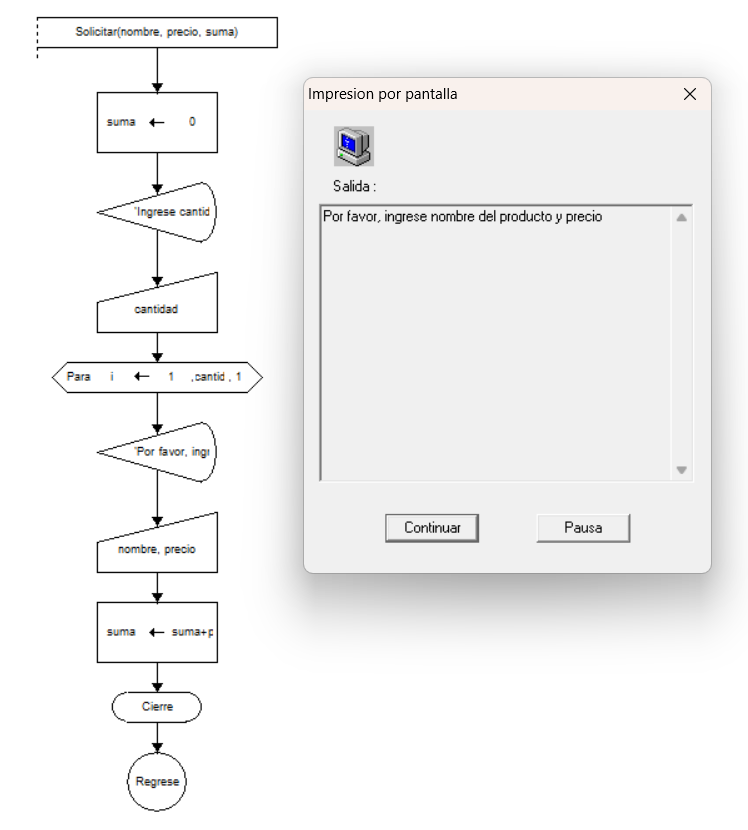

# ☕ Desafío 05 - Simulador de Pedidos en una Cafetería


---

## 📖 Descripción

Una cafetería desea automatizar el proceso de atención al cliente en el mostrador.

El sistema debe permitir registrar múltiples productos solicitados por un cliente, calcular el total de la compra y aplicar un descuento del **10%** cuando el cliente se encuentre registrado en el programa de fidelización.

Este proyecto fue desarrollado mediante un **Diagrama de Flujo en DFD 1.1**, aplicando conceptos fundamentales de programación estructurada.

---

## 🎯 Objetivo

Desarrollar un algoritmo que permita:

* Registrar la cantidad de artículos solicitados.
* Capturar el nombre de cada producto.
* Registrar el precio de cada artículo.
* Calcular el valor total del pedido.
* Verificar si el cliente está registrado.
* Aplicar un descuento del 10% cuando corresponda.
* Mostrar el valor final a pagar.

---

## 🧠 Lógica del Algoritmo

1. Solicitar la cantidad de artículos.
2. Inicializar el acumulador del total.
3. Repetir el proceso para cada artículo:

   * Solicitar nombre.
   * Solicitar precio.
   * Acumular el precio al total.
4. Consultar si el cliente está registrado.
5. Si está registrado:

   * Aplicar descuento del 10%.
   * Mostrar total con descuento.
6. Si no está registrado:

   * Mostrar total sin descuento.

---

## 📂 Estructura del Proyecto

```text
Desafío_05.Simulador de pedidos en una cafetería/
│
├── README.md
│
├── docs/
│   ├── diagrama1_principal.png
│   ├── diagrama2_funcion.png
│   └── ejecucion.png
│
├── ejemplos/
│   └── casos_prueba.txt
│
└── source/
    └── Simulador.dfd
```

---

## 🖼️ Diagramas del Proyecto

### 📌 Diagrama Principal



---

### 📌 Diagrama de Función



---

## ▶️ Ejecución del Programa



---

## 🔧 Variables Utilizadas

| Variable       | Tipo   | Descripción                                                |
| -------------- | ------ | ---------------------------------------------------------- |
| `cantidad`     | Entero | Cantidad de artículos solicitados por el cliente.          |
| `i`            | Entero | Contador utilizado para recorrer los artículos ingresados. |
| `nombre`       | Cadena | Nombre del producto solicitado.                            |
| `precio`       | Real   | Precio individual de cada producto.                        |
| `suma`         | Real   | Acumulador que almacena el valor total de la compra.       |
| `registro`     | Lógico | Indica si el cliente está registrado.                      |
| `precio_final` | Real   | Monto final a pagar después de aplicar el descuento.       |

---

## ⚙️ Función / Proceso Utilizado

### Registro de Productos

Este proceso permite registrar cada producto solicitado por el cliente.

**Entradas**

* Nombre del producto.
* Precio del producto.

**Proceso**

```text
Leer nombre
Leer precio
suma ← suma + precio
```

**Salida**

* Actualización del total acumulado de la compra.

---

## 🧮 Fórmulas Utilizadas

### Acumulación del Total

```text
suma ← suma + precio
```

Permite sumar el valor de cada producto al total de la compra.

---

### Aplicación del Descuento

```text
precio_final ← suma × 0.9
```

Aplica un descuento equivalente al 10% para clientes registrados.

---

### Total Sin Descuento

```text
precio_final ← suma
```

Mantiene el valor total cuando el cliente no está registrado.

---

## 🔄 Flujo General del Sistema

```text
Inicio
   ↓
Leer cantidad de artículos
   ↓
Repetir para cada artículo
   ↓
Leer nombre
   ↓
Leer precio
   ↓
Acumular total
   ↓
Consultar registro del cliente
   ↓
¿Está registrado?
   ↓
Sí → Aplicar descuento
No → Mantener total
   ↓
Mostrar total a pagar
   ↓
Fin
```

---

## 🧪 Casos de Prueba

### Caso 1 - Cliente Registrado

**Entrada**

```text
Cantidad: 3

Producto 1: Café
Precio: 8

Producto 2: Sándwich
Precio: 12

Producto 3: Jugo
Precio: 5

Registrado: SI
```

**Resultado Esperado**

```text
Total: 25
Descuento: 2.5
Total a pagar: 22.5
```

---

### Caso 2 - Cliente No Registrado

**Entrada**

```text
Cantidad: 2

Producto 1: Té
Precio: 6

Producto 2: Pastel
Precio: 10

Registrado: NO
```

**Resultado Esperado**

```text
Total a pagar: 16
```

---

## 🛠️ Herramientas Utilizadas

* 💻 DFD 1.1
* 🧩 Diagramas de Flujo
* 📚 Algoritmos Estructurados
* ⚙️ Visual Studio Code
* 🌐 Git
* 🐙 GitHub

---

## 🚀 Cómo Ejecutar

1. Abrir DFD 1.1.
2. Cargar el archivo:

```text
source/Simulador.dfd
```

3. Ejecutar el algoritmo.
4. Ingresar los datos solicitados.
5. Verificar el cálculo del total y el descuento aplicado.

---

## 📚 Conceptos Aplicados

* Variables y constantes
* Acumuladores
* Ciclos controlados (Para)
* Funciones / Procesos
* Condicionales (Si - Entonces)
* Entrada y salida de datos
* Operaciones aritméticas
* Descuentos porcentuales
* Modularización del algoritmo

---

## 📌 Resultados de Aprendizaje

Mediante este proyecto se practican conceptos fundamentales de programación estructurada:

* Uso de ciclos para procesar múltiples registros.
* Implementación de funciones/procesos.
* Acumulación de valores mediante variables.
* Aplicación de condiciones lógicas.
* Cálculo de descuentos porcentuales.
* Diseño de algoritmos modulares utilizando DFD 1.1.

---

## 👨‍💻 Autor

Proyecto académico desarrollado con fines educativos para practicar algoritmos, diagramas de flujo y programación estructurada utilizando DFD 1.1.

Repositorio creado para documentación, aprendizaje y control de versiones mediante Git y GitHub.
